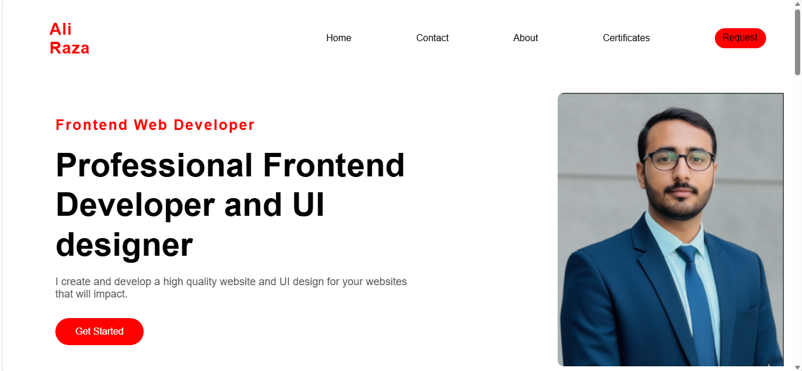
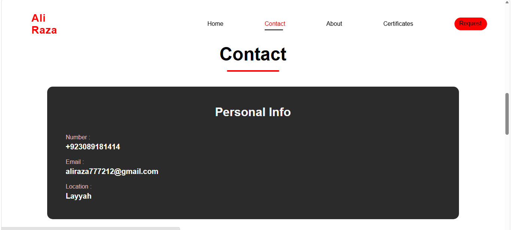
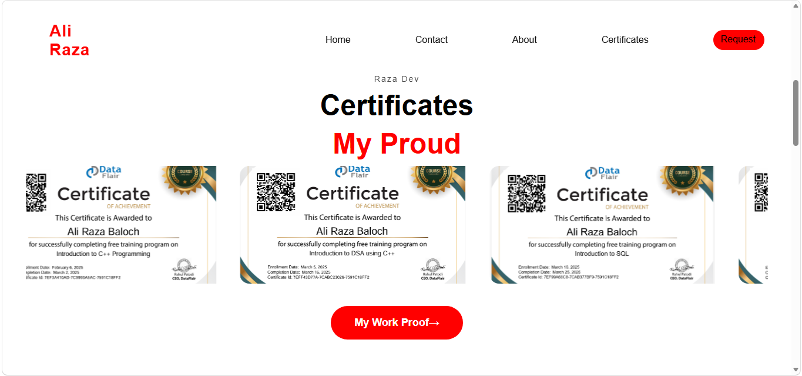
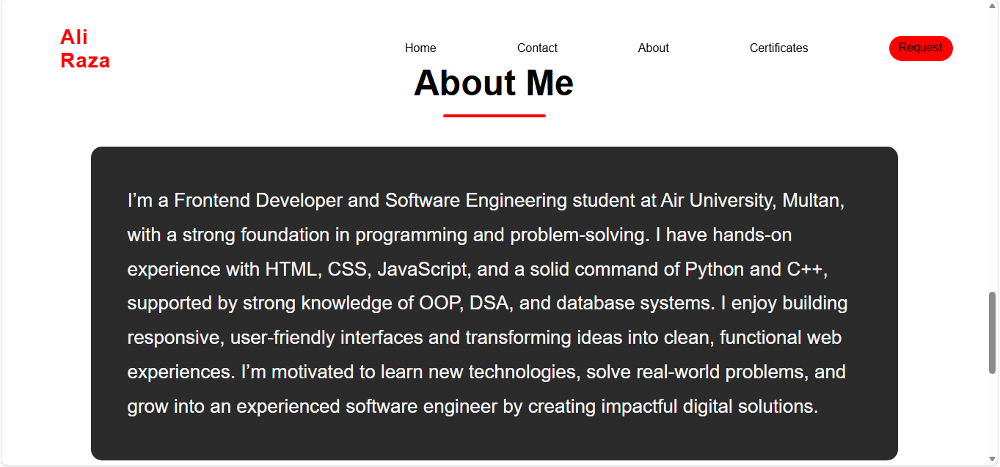
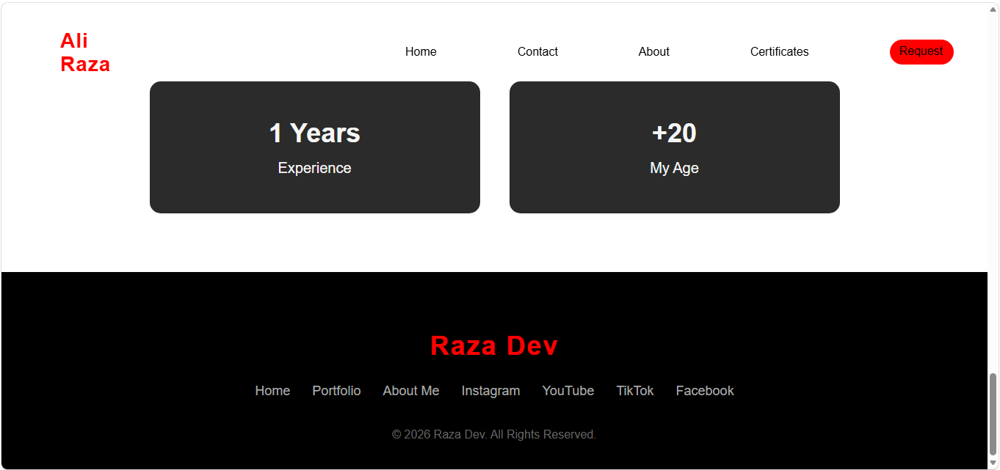

Personal Portfolio Website

Overview
This repository contains the source code for my personal portfolio website, developed to present my professional profile, technical skillset, and project experience in a structured and visually engaging manner.

The portfolio is designed with a strong focus on clean architecture, responsive design, and user-centric interface principles, ensuring consistency and accessibility across a wide range of devices.

Key Features
Fully Responsive Design – Ensures optimal viewing experience across mobile, tablet, and desktop devices
Structured Project Showcase – Highlights selected projects with clear presentation of functionality and impact
Professional UI/UX Design – Emphasis on usability, readability, and modern design standards
Modular Codebase – Organized and maintainable structure for scalability and future enhancements
Performance-Oriented – Lightweight implementation with efficient loading behavior
UI of my project at the web interface look like that:

Technology Stack

The project is built using modern web development technologies:

HTML5 – Semantic and accessible markup
CSS3 – Custom styling and layout management
JavaScript (ES6+) – Interactive and dynamic behavior
(Add React / Tailwind / Bootstrap if applicable)
Project Structure
├── assets/          # Static resources (images, icons, media)
├── css/             # Stylesheets and design assets
├── js/              # JavaScript logic and interactivity
├── index.html       # Application entry point
└── README.md        # Project documentation

To run this project locally:
Clone the repository

git clone https://github.com/Ali1414-developer/Portfolio 

Navigate to the project directory

cd your-repository
Open the project
Launch index.html in your preferred browser
Alternatively, use a local development server for better performance

Contribution
While this is a personal project, constructive feedback and suggestions are appreciated. Feel free to open issues or submit pull requests where relevant.

Contact me:
For professional inquiries or collaboration opportunities:

Email: alirazabaloch4173@gmail.com
LinkedIn: https://www.linkedin.com/in/ali-raza-5b1728352/

This project is open-source and available for reference and learning purposes.
Acknowledgment
This portfolio reflects my ongoing development as a software engineer, with continuous improvements aligned to industry best practices.
